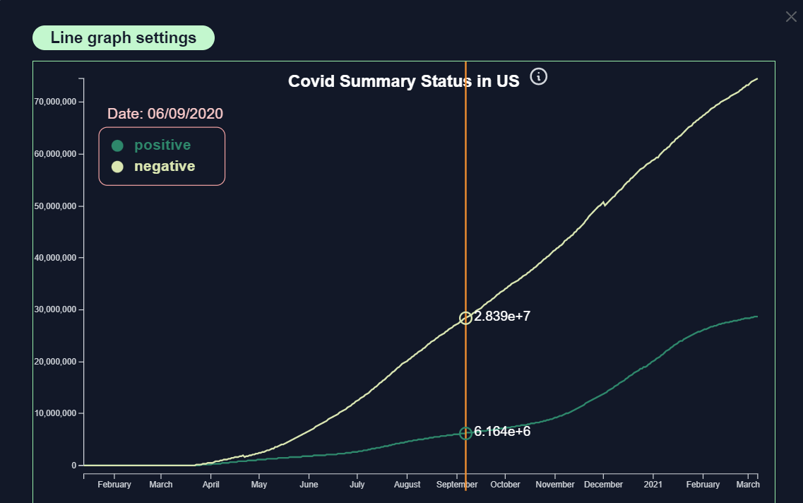

<!-- icons  -->
[1.1]: https://img.shields.io/badge/GitHub-100000?style=for-the-badge&logo=github&logoColor=white
[2.1]: https://img.shields.io/badge/LinkedIn-0077B5?style=for-the-badge&logo=linkedin&logoColor=white
[3.1]: https://img.shields.io/badge/Medium-12100E?style=for-the-badge&logo=medium&logoColor=white
[4.1]: https://img.shields.io/badge/Twitter-1DA1F2?style=for-the-badge&logo=twitter&logoColor=white

<!-- links to your social media accounts -->

[1]: https://github.com/produdez
[2]: https://www.linkedin.com/in/produdez/
[3]: https://medium.com/@produde
[4]: https://twitter.com/_Produde_

# Geo-covid (Frontend)

<p align="center">
    
</p>

**Description:**

Geo-covid: A data dash board for the Covid 19 situation in the USA

This repo is the front-end for my geo-covid project (a data dashboard embedded as a web application).

Back-end repository can be found [here](https://github.com/produdez/geo-covid-backend)

## Demo

As of current *(time of this commit)*, demo is online at [Link](https://geo-covid-frontend.web.app/)


> please excuse the slow initial loading time, it's a free hosted backend and database

## Features

The dashboard aims to

1. Daily full map view of one country’s COVID 19 situation divided by its regions
2. Let user view historical date through altering a time slider to change date
3. Basic statistics of the whole country including:
   1. Top raking regions on covid infection
   2. Line chart of total infections
   3. Today's covid distribution between visualized by bar chart
4. Hovering on a region will show its basic info, clicking on it will show a timeline of Covid in the region

## Technologies Used

- Angular
- TypeScript
- Leaflet (map rendering)
- D3.js (graphing)
- Tailwind + SASS (styling)
- Eslint (linting)

## Screenshot

| Dakota state Covid timeline | Covid distribution (30/05/2020)
| -- | -- |
|  | |

| All time covid timeline | Top chart covid infection (10/03/2020)
| -- | -- |
|  | |

## Setup

Requirements and Installations:

1. Install packages

    ```[bash]
        npm install
    ```

2. Setup environment

   ```[bash]
        cp .env.dist .env
   ```

## Usage

### Build

Run `ng build` to build the project. The build artifacts will be stored in the `dist/` directory.

### Development server

- Run `ng serve` for a dev server.
- Navigate to `http://localhost:4200/`. 
- The application will automatically reload if you change any of the source files.

## Project Structure

- `/data`: raw csv data
- `/scripts`: script to load data to database: include a `.py` version and a `notebook.ipynb` version to show step by step execution
- `/us_covid_api` main project files, inside includes these main files:
    1. `models.py`: Object relational mapping of database items/table
    2. `serializers.py`: Turn Object to JSON object
    3. `views.py`: Request/Endpoint
    4. `urls.py`: Set endpoint URL

## Contact

Created by [@produdez](https://github.com/produdez) - feel free to contact me or follow my blog on medium ❤️!

<!-- [![alt text][1.1]][1] -->
[![alt text][2.1]][2]
[![alt text][3.1]][3]
[![alt text][4.1]][4]

This project was generated with [Angular CLI](https://github.com/angular/angular-cli) version 14.0.6.
